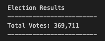
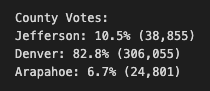
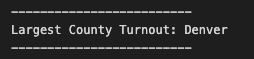
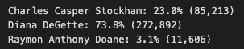
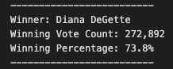

# Election_Analysis
This is a module 3 project that will use "Terminal" and "Visual Studio" applications.

## Overview of Election Audit

Tom, a Colorado Board of Elections employee, requested help in completing the audit of a recent local congressional election.
  
Below are the results of the data analysis that was provided to Seth and his Team with the findings of the following tasks in the first draft of the election audit:
  
1. Calculate the total number of votes cast.
2. Get a complete list of candidates who received votes.
3. Calculate the total number of votes each candidate recieve.
4. Calculate the percentage of votes each candidate won.
5. Determine the winnner of the election on poppular vote.
  
In order to complete the audit, the election commission has requested some additional data as specified below. They would like to confirm the voter turnout for each county that voted in this congressional district.
  
The findings of the following tasks were added to the final election audit:

1. Calculate the voter turnout for each county.
2. Calculate the percentage of votes from each county out of the total count.
3. Determine the county with the highest turnout.

## Resources

**Data Source:** election_results.csv
**Software:** Python 3.7.6, Visual Studio Code, 1.38.1

## Election Audit Summary

The data analysis of the election shows that:

1. There were **"369,711"** votes cast in the congressional election.

2. Below is a breakdown of the number of votes and the percentage of total votes for each county in the precinct:

- County Votes:
  - Jefferson: 10.5% (38,855 total votes)
  - Denver: 82.8% (306,055 total votes)
  - Arapahoe: 6.7% (24,801 total votes)

3. The county that had the largest numbe rof votes is *Denver*.

4. Below is a list of candidates and a breakdown of the number of votes and the percentage of the total votes each candidate received:

- The candidates were:
  - Charles Casper Stockham
  - Diana DeGette
  - Raymon Anthony Doane
  
 - The candidate results were:
  - Charles Casper Stockham received **23.0%** of the vote and *85,213* number of votes.
  - Diana  DeGette received **73.8%** of the vote and *272,892* number of votes.
  - Raymon Anthony Doane received **3.1%** of the vote and *11,606* number of votes.
  
 5. The **winner** of the election was:
 
  - **Diana DeGette**, who received **73.8%** of the vote and **272,892** number of votes.
  
 ## Election Data Summary
   
  **Election Results:**
  
  
  
  **County Votes Results:**
  
  
  
  **Largest County Turnout:** 
  
  
  
  **Candidate Results:**
  
  
  
  **Election Winner:**
  
  
 
## Election-Audit Summary

Recommendations:

1. The data analysis tool "Python scripts" that was created for this specific tasks can be used for future congressional election as long as the election results template remain the same. The code can be further modified to perform data analytics on:
- Senatorial distric elections,
- Local elections, and
- Analyze for voters fraud.

2. Hire a data programmer to further optimize the program by Code Refactoring to further clarify and simplify the design of existing codes and accomodate new data that will be pertinent for the outcome of any type of election. 
